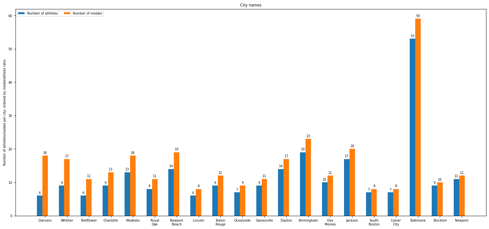

# COM-480 - Data Visualization Milestone 1  
**École Polytechnique Fédérale de Lausanne (EPFL)**  
**Authors:** Albert Fares, Hugo Jeannin, Daniel Polka  

## Medalytics, a data-driven exploration of the Olympic Games

---

## Datasets

For this project, we will use multiple datasets from a [GitHub repository](https://github.com/KeithGalli/Olympics-Dataset/tree/master?tab=readme-ov-file) owned by Tech YouTuber and MIT graduate Keith Galli. The data originally came from [Olympedia.org](https://www.olympedia.org/) and provides information about summer and winter Olympic games from 1896 to 2022.

The repository contains both the raw data and the data cleaned by Galli, so we will mostly use the data that has already been processed. The data cleaning process is detailed in a Jupyter notebook provided in the repository and consists mostly of parsing dates, removing bullet points from name fields, and so on. The remaining data is fairly well organized but still had a few issues; for instance, the *NOC* column was named `noc` in one of the cleaned `.csv` files and `NOC` in the others, and certain country names weren't constant in the various files (for example, USA and United States were used interchangeably).

The file `bios_locs.csv` contains biographical information on each athlete such as their name, country of origin, date of birth, *NOC* (National Olympic Committee), height, weight, and so on. Details of each event athletes competed in and their results in that event can be found in `results.csv`.

The repository also contains additional `.csv` files with information on each country's population and their corresponding *NOC*.

---

## Problematic

### Overview

The Olympic Games stand as the ultimate stage for international sports competition, uniting athletes from across the world to showcase their skills and determination. Since the first modern Games in 1896, the Olympics have undergone profound transformations—not only in terms of athletic performance but also in their social, political, and cultural impact.

We think that it would be interesting to show, among other things, the number of athletes and medals per country, ranked by the `medals/number_of_athletes` ratio, and the evolution of the proportion of men to women from the very first Olympic Games up to the 2022 Games (the most recent in the dataset). We'd also like to make a few interactive maps, with one showing which countries hosted games and in which year, and another showing the statistics of each country (number of medals and athletes).

The reasons for choosing this dataset were simply that Lausanne is the Olympic capital and because the last Olympic Games were held next door to Switzerland, in Paris.

### Target Audience

The Olympics captivate a diverse audience—from sports enthusiasts and historians to analysts and policymakers. Our project is designed to engage casual fans, who may be drawn to the visualization for fun facts, medal counts, and record-breaking moments. It could also be of interest to sports historians and researchers, looking to analyze long-term trends in performance, participation, and shifting global dominance.

### Key Questions & Objectives

Through our data visualization, we seek to explore fundamental questions such as:

- Who are the best athletes by game, country, age...?
- What trends emerge in gender participation, new sports, and shifting national dominance?
- How do different nations compare in their Olympic journeys?
- Does population size or economic strength play a significant role in medal counts?

---

## Exploratory Data Analysis

To help visualize the data at this stage, we plotted three graphs using *pandas* and *Matplotlib* (you can see the code used to generate them in the `analyze_data.ipynb` notebook).

The first graph captures the evolution of the proportion of men to women over the years (blue line), with the bars representing the absolute number of men and women athletes.

The second and third graphs represent the total number of athletes and medals (cumulated over the years), respectively per country and per US athletes' birthplace. The countries and cities (top 20) are ranked by the `medals/num_athletes` ratio.

---

## Related Work

Keith Galli provided a [video](https://www.youtube.com/watch?v=oad9tVEsfI0&ab_channel=KeithGalli) on how he cleaned the datasets we are using, but we don't know about any further use of the data.

We want to design a dynamic experience that includes a clickable world map for host countries and medal-winning nations, inspired by implementations we have seen in previous COM-480 projects.

Unlike traditional medal tables or charts, our project will provide an interactive experience where users will be able to explore Olympic history dynamically.

Additionally, we will create sortable rankings for athletes based on gender, age, and sport, allowing users to uncover patterns in Olympic history while simultaneously personalizing their exploration. To further enhance the experience, we plan to implement a bar chart race animation for the most decorated athletes, drawing inspiration from similar visualizations often seen on social media, particularly in music billboard rankings.

We also aim to highlight emerging trends in Olympic sports by exploring the introduction of new disciplines and identifying the most frequently played sports throughout the Games. This could be visualized via a timeline of new sports introduction.
